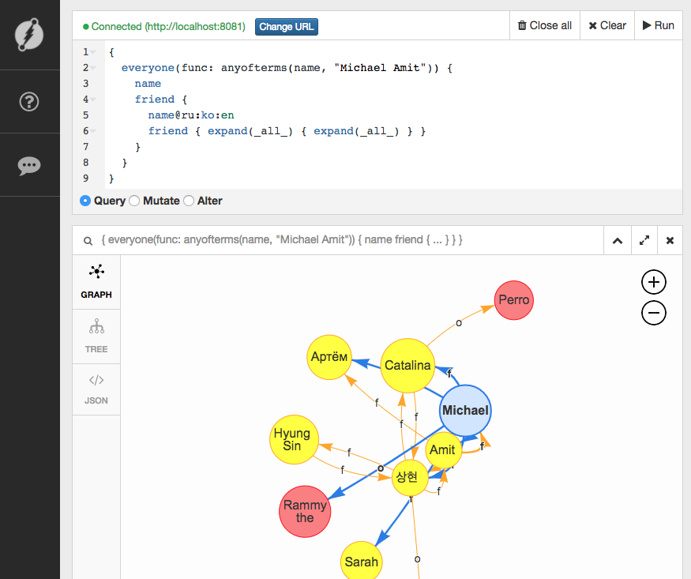

# plain-dgraph
Plain dgraph image

## Start Stack and open WebUI.

```
$ docker stack deploy -c docker-compose.yml dgraph
Creating network dgraph_default
Creating service dgraph_server
Creating service dgraph_ui
Creating service dgraph_zero
$
```

The webUI is accessible under [localhost:8082](http://localhost:8082), the server to connect to is `http://localhost:8081`.


## Tour de Dgraph ([link](https://tour.dgraph.io/))

A little example is provided by the dgraph.io folks (link in the title).


#### Load a Schema

This one uses the endpoint: **/ALTER**.

```
name: string @index(term) .
age: int @index(int) .
friend: uid @count .
```
#### Put data in

Using the endpoint **/MUTATE** data is inserted into the database.

```
{
  set {
    _:michael <name> "Michael" .
    _:michael <age> "39" .
    _:michael <friend> _:amit .
    _:michael <friend> _:sarah .
    _:michael <friend> _:sang .
    _:michael <friend> _:catalina .
    _:michael <friend> _:artyom .
    _:michael <owns_pet> _:rammy .

    _:amit <name> "अमित"@hi .
    _:amit <name> "অমিত"@bn .
    _:amit <name> "Amit"@en .
    _:amit <age> "35" .
    _:amit <friend> _:michael .
    _:amit <friend> _:sang .
    _:amit <friend> _:artyom .

    _:luke <name> "Luke"@en .
    _:luke <name> "Łukasz"@pl .
    _:luke <age> "77" .

    _:artyom <name> "Артём"@ru .
    _:artyom <name> "Artyom"@en .
    _:artyom <age> "35" .

    _:sarah <name> "Sarah" .
    _:sarah <age> "55" .

    _:sang <name> "상현"@ko .
    _:sang <name> "Sang Hyun"@en .
    _:sang <age> "24" .
    _:sang <friend> _:amit .
    _:sang <friend> _:catalina .
    _:sang <friend> _:hyung .
    _:sang <owns_pet> _:goldie .

    _:hyung <name> "형신"@ko .
    _:hyung <name> "Hyung Sin"@en .
    _:hyung <friend> _:sang .

    _:catalina <name> "Catalina" .
    _:catalina <age> "19" .
    _:catalina <friend> _:sang .
    _:catalina <owns_pet> _:perro .

    _:rammy <name> "Rammy the sheep" .

    _:goldie <name> "Goldie" .

    _:perro <name> "Perro" .
  }
}
```

#### Query Data

By fireing up a query against the endpoint **/QUERY** (suprise!), the data is visualised nicely.

